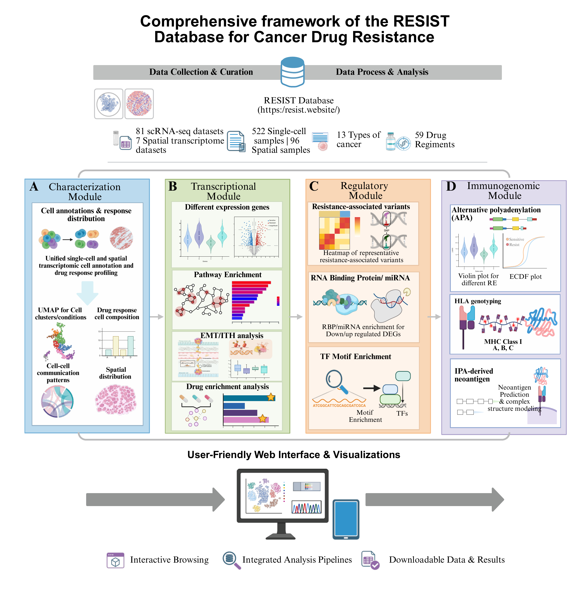

<h1 align="center">RESIST</h1>

<p align="center">
  <b>A single-cell and spatial omics resource for studying regulatory mechanisms<br/>
  underlying cancer drug resistance</b>
</p>

<p align="center">
  <a href="https://resist.website/">Explore the database</a> ·
  <a href="TUTORIAL.md">Example-data tutorial</a> ·
  <a href="docs/outputs.md">Output catalog</a> ·
  <a href="docs/hpc.md">HPC guide</a>
</p>

## Overview

Cancer drug resistance involves changes in cellular composition, transcriptional
programs, regulatory interactions, and immunogenomic features. RESIST brings
together single-cell RNA sequencing and spatial transcriptomics to investigate
these complementary aspects of treatment response.

The resource comprises **81 scRNA-seq datasets and 7 spatial transcriptomics
datasets**, covering **522 single-cell samples, 96 spatial samples, 13 cancer
types, and 59 drug regimens**. This repository contains analysis code organized
into four modules, with configuration files, reference-data instructions, and a
worked example. Processed data and results can be explored through the
[RESIST database](https://resist.website/).

## Workflow

<p align="center">
  
</p>

**Figure 1. RESIST workflow.** Curated single-cell and spatial datasets support
four complementary analysis modules, connecting cellular characterization with
transcriptional, regulatory, and immunogenomic analyses. The web interface
supports interactive browsing, visualization, and access to data and results.
The figure summarizes the resource; individual analyses require different inputs
and are selected according to data availability.

## Analysis modules

| Module | Biological focus | Analyses and products |
|---|---|---|
| **[A · Characterization](docs/module-a.md)** | Cellular composition and organization | Existing UMAP embeddings, cluster composition by response, CellChat communication patterns, and spatial distributions |
| **[B · Transcriptional](docs/module-b.md)** | Expression programs associated with resistance | Differentially expressed genes, GO/KEGG/Hallmark enrichment, intratumor heterogeneity, EMT scores, and LINCS signature connectivity |
| **[C · Regulatory](docs/module-c.md)** | Candidate regulatory associations | Variant-analysis components and enrichment of RNA-binding-protein and miRNA target sets |
| **[D · Immunogenomic](docs/module-d.md)** | RNA-processing and immune-presentation features | Alternative polyadenylation, HLA typing, and candidate peptide–MHC structural analysis |

The module guides describe each script's inputs, dependencies, and scope.
Availability of individual components, including the TF motif panel shown in
Figure 1, is explained under [Implementation scope](#implementation-scope).

## Quick start

Run the analyses on an HPC system with suitable storage and memory. Begin from
the repository root. If using a downloaded package ZIP, extract it on the HPC,
enter its directory, and skip the two Git checkout commands below:

```bash
git clone https://github.com/QSong-github/RESIST.git RESIST
cd RESIST
conda env create -f config/setup/environment.yml
conda activate resist
Rscript config/setup/install_r_packages.R
```

Follow [tutorial Steps 2–3](TUTORIAL.md#step-2--download-the-example-directly-onto-the-hpc)
to download **`GSE104987_seurat_afterAnno.RDS`** directly onto the HPC, unpack the
bundled references, and inspect the input. The example profile writes to
`data/results/example/`. Its A–C walkthrough does not require the large LINCS
database or raw sequencing files.

### A. Characterization

```bash
bash run_A.sh --config config/example.yaml
```

**Runs A1.** Produces a four-panel figure showing existing UMAP embeddings by
cluster, condition, and cell type, together with cluster composition by response.
The **PDF and PNG** are written to `data/results/example/A/`.

### B. Transcriptional analysis

```bash
bash run_B.sh --config config/example.yaml
```

**Runs B1 and B4.** Produces **full and significant DEG tables (CSV)**, a
**tumor-cell volcano plot**, and an **intratumor-heterogeneity box plot (PDF/PNG)**
under `data/results/example/B/`. Positive log fold changes indicate higher
expression in resistant cells. Run B before C.

### C. Regulatory analysis

```bash
bash run_C.sh --config config/example.yaml
```

**Runs C7 and C8.** Uses B1's full DEG table and the bundled RBP targets to produce
an **RBP-enrichment table (CSV)** and eligible **RBP circle plots (PDF/PNG)** under
`data/results/example/C/`. Figures depend on significance and count thresholds;
an enrichment table can be produced without a corresponding plot.

### D. Immunogenomic analysis

Prepare a separate APA cohort using
[tutorial Step 7](TUTORIAL.md#step-7--module-d-with-a-separately-prepared-apa-cohort),
then run:

```bash
bash run_D.sh --config config/config.yaml --apa-config config/apa_config.yaml
```

**Runs D3.** Requires scUTRquant TXS outputs, filtered 10x matrices, an annotation
Seurat object, and the matching GTF. Produces **gene-by-cell relative-expression
matrices (RDS)**, **per-cell summaries and mapping diagnostics (CSV)**,
**differential APA tables**, and eligible **ECDF/violin figures** under
`data/results/D/APA/<cohort_id>/`.

The shared GSE104987 Seurat example does not supply these APA inputs.
HLA typing and structural modeling have separate commands and prerequisites in
the [Module D guide](docs/module-d.md).

### Select additional steps

The four commands above have explicit default coverage. Additional analyses are
selected with `--steps`; `--list` displays choices and expected products, while
`--check` inspects prerequisites without running the analysis:

```bash
bash run_B.sh --list
bash run_B.sh --config config/example.yaml --steps B5 --check
bash run_B.sh --config config/example.yaml --steps B5
```

See the [tutorial](TUTORIAL.md) for pathway, EMT, miRNA, and LINCS extensions and
the [output catalog](docs/outputs.md) for filenames and eligibility conditions.

## Repository layout

```text
RESIST/
├── README.md                  resource overview and quick start
├── TUTORIAL.md                step-by-step example-data walkthrough
├── run_A.sh … run_D.sh        module entry points
├── config/                   paths, sample sheets, dependencies, SLURM template
├── scripts/                  A–D analyses, shared R functions, utilities
├── data/                     compressed references and small input templates
└── docs/                     workflow figure, module guides, and technical notes
```

Input, expanded-reference, and result directories are created on the HPC as
needed. See the [repository guide](docs/repository-guide.md) for the script
organization and configuration conventions.

## Data and configuration

`config/config.yaml` defines the main data, reference, and result locations:

```yaml
paths:
  data: data/input
  spatial_data: data/spatial
  ref_data: data/reference
  results: data/results
```

Relative paths resolve against the repository root; absolute paths allow inputs
and references to remain on shared HPC storage. Use `config/example.yaml` for the
worked example and the separate APA configuration/sample sheet for D3.

The [input-data guide](docs/input-data.md) describes the Seurat metadata and
branch-specific inputs. The [reference-data guide](docs/references.md) distinguishes
the compressed bundle from external resources such as LINCS and miRDB. Download
large references only for analyses that need them.

## Implementation scope

The example begins with an annotated, processed Seurat object. A1 displays its
existing annotations and embeddings. Communication, spatial, variant, and
immunogenomic analyses require additional data and external tools.

The VCF-to-allele-frequency conversion step **C2** and the **TF motif-enrichment
implementation** are not included in the supplied code. Other branches retain
method- and cohort-specific assumptions documented in the module guides. Full
workflow execution and numerical validation remain to be completed on the HPC;
the [validation record](docs/validation.md) states the checks performed so far.

Use the [methods and limitations](docs/methods-and-limitations.md) when interpreting
results or adapting the pipeline to new studies. Cell-level contrasts and
enrichment results support exploratory associations; candidate mechanisms,
compounds, and neoantigens require appropriate experimental validation.

## Reproducibility

Each module runner records selected steps, configuration and script hashes,
package versions, step logs, and the files written during the run under
`<results>/logs/`. Failures stop execution, and steps that produce no new output
are identified explicitly. Use a separate results path when comparing analyses
with different inputs or settings. The [HPC guide](docs/hpc.md) covers submission
and environment recording. Run `bash run_A.sh --version` to identify the
installed package; see the [release notes](docs/release-notes.md) for changes.

## Citation and acknowledgements

Please cite the RESIST resource, the original datasets, and the analysis tools
used in your work. Resource citation metadata is provided in
[CITATION.cff](CITATION.cff). We acknowledge the investigators who generated the
underlying datasets and the developers of the community software used by RESIST.
